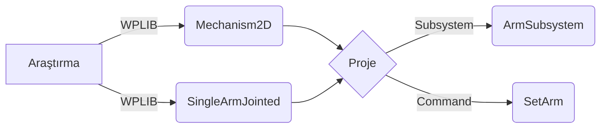

#                     Team 7285 - Beşiktaş Rsports  Elektronik ve Yazılım Ekibi Mülakatı Raporu

> *İstenilen rapor sayfanın aşağısındadır.*

Simülasyonu çalıştırmak için `Teleoperated` moduna geçin.

# Kontroller                                 

| Event     | Buttons   |
| --------- | ------------:|
| Position 1| Button 1|
| Position 2| Button 2|
| Position 3| Button 3|
| Position 4| Button 4|  

## Önizleme

<i>

Position 1

 

Position 2

 

Position 3

 

Position 4

 

# Araştırma
Kullanılması istenen sınıfları daha önce kullanmadığım için öncelikle onlara bakmam gerekiyordu. İlk olarak, WPILib'deki [Robot Simulation ](https://docs.wpilib.org/en/stable/docs/software/wpilib-tools/robot-simulation/index.html) bölümünü tamamen okuyarak işe başladım. Burayı bitirdikten sonra [Glass](https://docs.wpilib.org/en/stable/docs/software/dashboards/glass/index.html) bölümünü de aynı şekilde baştan sona okudum. Ardından bu sınıfları kullanarak yapılmış projelere göz attım. Artık başlamak için hazırdım.

FRC'deki ilk yılım ve daha önce bu proje üzerinde deneyimim olmadığı için, hızlı deneme yanılma süreci için [Timed ](https://docs.wpilib.org/tr/latest/docs/software/vscode-overview/creating-robot-program.html#timedrobot) bir proje oluşturdum ve robotu kodlamaya başladım. Projem artık tamamlanmış durumdaydı ve zamanlı projemi bir kenara koyarak projeyi Command-Based yapısına geçirmeye karar verdim. Planım , aşağıdaki algoritmadaki gibi tam olarak aynıydı.

Projemde, tek kafamın karıştığı konu 10:1 redüksiyon oranıydı. Bu oranı double olarak belirtmem gerektiği için arkadaşlarımla ve internet araştırmalarımla 10 üzerinde bir değeri kullanmaya karar verdim. armSubsystem'un 31. satırında redüksiyon oranını 10 olarak belirttim, ancak içimi rahat etmemişti çünkü belirtmediğim haliyle 10 verdiğim hali arasında büyük bir hız farkı vardı.
